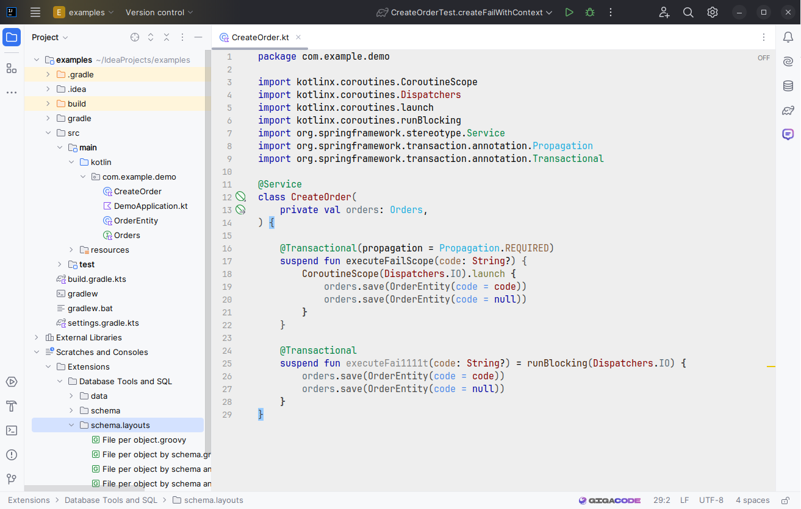

## IntelliJ IDEA color theme "Igor"

### How to install:
1) download Igor.icls file
2) Import theme in IntelliJ IDEA:

Settings... / Appearance & Behavior / Appearance / Editor color scheme / Import Scheme / IntelliJ IDEA color scheme (.icls)...

