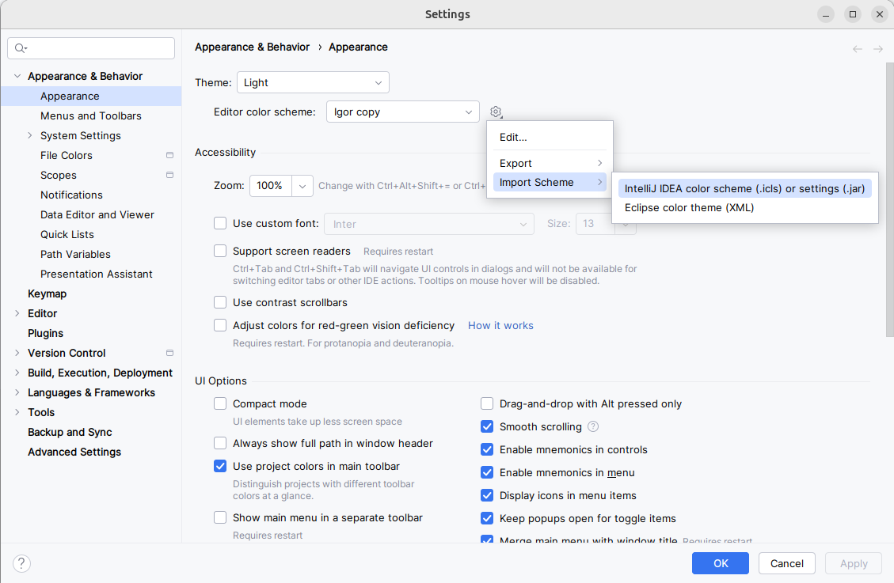
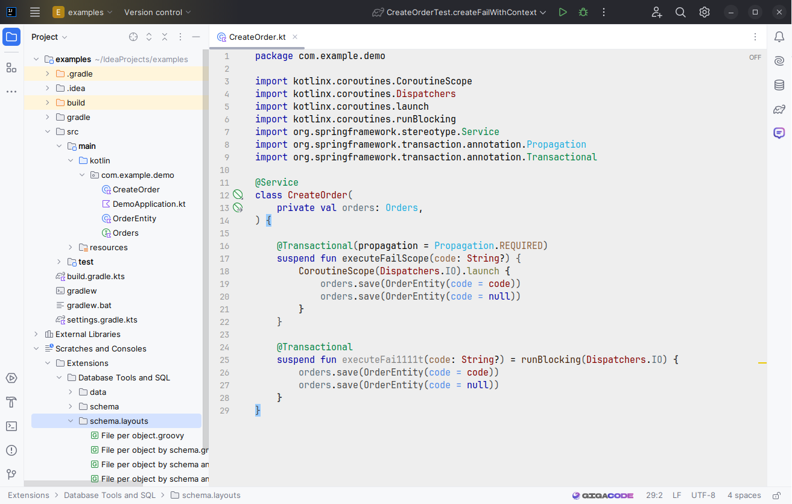

## IntelliJ IDEA color theme "Igor"

### How to install:
1) Download file src/Igor.icls.
2) Import theme in IntelliJ IDEA:

Settings... / Appearance & Behavior / Appearance / Editor color scheme / Import Scheme / IntelliJ IDEA color scheme (.icls)...

